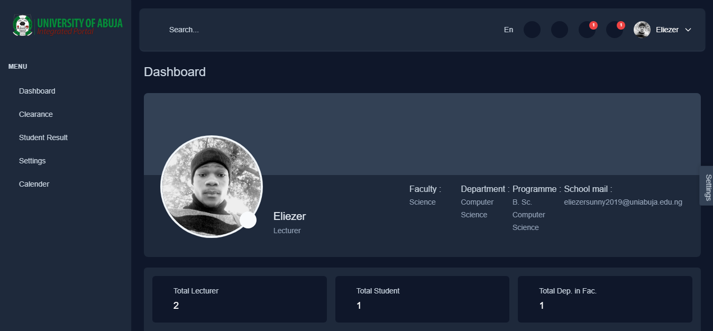

# ALX Portfolio Project University of Abuja School Management System (Laravel Project)

## Overview

The University of Abuja School Management System, built on the Laravel framework, is a specialized solution tailored to address the unique administrative challenges of the University of Abuja. This Laravel-based system offers a robust and scalable platform for efficient management of students, faculty, courses, and various academic processes.

## Features

- **Student Management:**
  - Automated enrollment and registration processes.
  - Dynamic student information tracking and academic record management.

- **Faculty Management:**
  - Faculty details, assignment tracking, and communication tools.
  - Seamless integration with Staff.

- **Course Management:**
  - Curriculum design, course scheduling, and exam result tracking.
  - Seamless integration with academic calendars for precise planning.

- **Clearance Management:**
  - Curriculum design, and online clearance system.
  - Seamless integration with academic Staff.

- **User Authentication:**
  - Laravel's secure authentication system for students, faculty, and administrators.

  * Student login page:

* Student dashboard page:

* Lecturer login page:

* Lecturer dashboard page:

* Admin login page:

* Admin dashboard page:

- **Reports and Analytics:**
  - Generate comprehensive reports on student performance, attendance, and more.
  - Leverage Laravel's Eloquent ORM for efficient data querying and analysis.

## Technologies Used

- **Laravel Framework:** Version 10.x
- **Database:** MySQL
- **Frontend:** Laravel Blade, Bootstrap, and Tailwind CSS.
- **Backend:** Laravel.
- **Package:** Laravel, Bootstrap, Tailwind CSS and Spatie.

## Installation

1. Clone the repository.
2. Install Composer dependencies.
3. Configure the `.env` file with specific details for the University of Abuja setup.
4. Run migrations for the database.

For detailed installation instructions, please refer to the [Installation Guide](https://laravel.com/docs/10.x/installation).

## Usage

1. Access the system through the provided URL.
2. Log in using University of Abuja credentials.
3. Navigate through Laravel-powered modules designed for managing students, faculty, and courses.
4. Leverage the Eloquent ORM for efficient data manipulation and retrieval.
5. Utilize Laravel's Blade templating engine for a dynamic and responsive user interface.

## Login details

### Admin Logins

url: 127.0.0.1:8000/lecturer/admin

1. email: eliezersunny@eliezersunny.com password: 12345
2. email: paulsontsemaye@paulsontsemaye.com password: 12345

### Lecturer Logins

url: 127.0.0.1:8000/lecturer

1. email: eliezersunny@eliezersunny.com password: 12345
2. email: paulsontsemaye@paulsontsemaye.com password: 12345
3. email: priceless@priceless.com password: 12345

### Student Logins

url: 127.0.0.1:8000

1. matric no: CSC/2371/001 password: 12345
2. matric no: ACC/2362/001 password: 12345

## Case Study - University of Abuja

Provide a concise case study highlighting the University of Abuja's specific requirements and how the Laravel framework, with its expressive syntax and powerful features, addresses these needs effectively.

## Contributors

- [Eliezer Sunny](https://twitter.com/eliezersunny).

## About Laravel

Laravel is a web application framework with expressive, elegant syntax. We believe development must be an enjoyable and creative experience to be truly fulfilling. Laravel takes the pain out of development by easing common tasks used in many web projects, such as:

- [Simple, fast routing engine](https://laravel.com/docs/routing).
- [Powerful dependency injection container](https://laravel.com/docs/container).
- Multiple back-ends for [session](https://laravel.com/docs/session) and [cache](https://laravel.com/docs/cache) storage.
- Expressive, intuitive [database ORM](https://laravel.com/docs/eloquent).
- Database agnostic [schema migrations](https://laravel.com/docs/migrations).
- [Robust background job processing](https://laravel.com/docs/queues).
- [Real-time event broadcasting](https://laravel.com/docs/broadcasting).

Laravel is accessible, powerful, and provides tools required for large, robust applications.

## Learning Laravel

Laravel has the most extensive and thorough [documentation](https://laravel.com/docs) and video tutorial library of all modern web application frameworks, making it a breeze to get started with the framework.

You may also try the [Laravel Bootcamp](https://bootcamp.laravel.com), where you will be guided through building a modern Laravel application from scratch.

If you don't feel like reading, [Laracasts](https://laracasts.com) can help. Laracasts contains over 2000 video tutorials on a range of topics including Laravel, modern PHP, unit testing, and JavaScript. Boost your skills by digging into our comprehensive video library.

## Security Vulnerabilities

If you discover a security vulnerability within Laravel, please send an e-mail to Taylor Otwell via [taylor@laravel.com](mailto:taylor@laravel.com). All security vulnerabilities will be promptly addressed.

## License

The Laravel framework is open-sourced software licensed under the [MIT license](https://opensource.org/licenses/MIT).

## Acknowledgments

- Acknowledge any external Laravel packages or resources used.
- Express gratitude to Laravel's community for support and inspiration.

Customize this template based on your project's specifics, emphasizing the integration of Laravel and its features tailored to the University of Abuja's School Management System.

